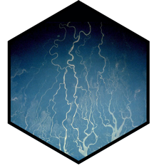

# rivr: A package for teaching open-channel hydraulics 

<!-- badges: start -->

<!-- badges: end -->

See the documentation at [hydroecology.net/rivr](https://hydroecology.net/rivr)

This package is designed as an educational tool for students and instructors 
of undergraduate and graduate courses in open channel hydraulics. Functions are 
provided for computing flow and channel geometry, normal and critical depth, 
gradually-varied water-surface profiles (e.g. backwater curves) and unsteady 
flow (e.g. flood wave routing). For more information, see [our article in the R Journal](https://journal.r-project.org/archive/2015-2/koohafkan-younis.pdf).
